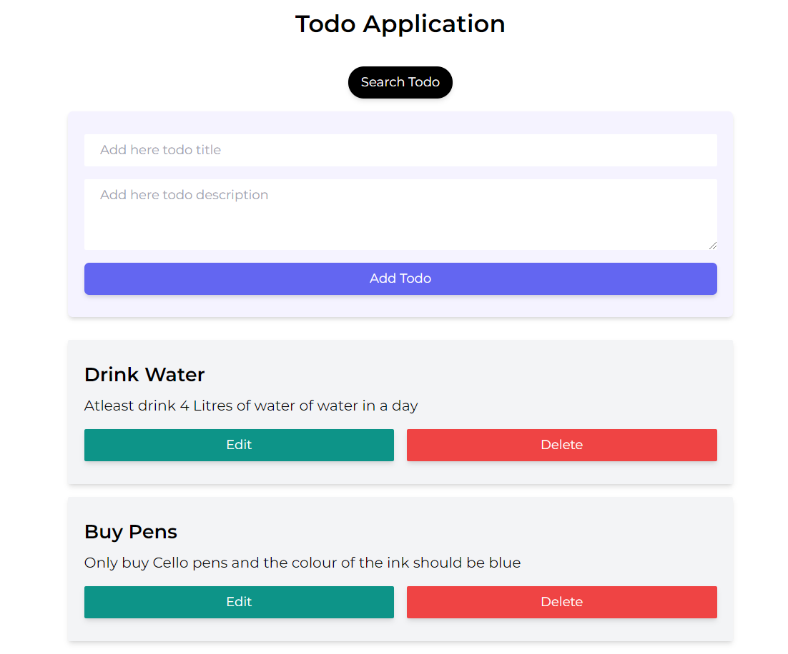
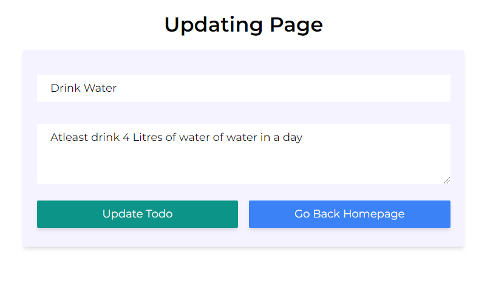
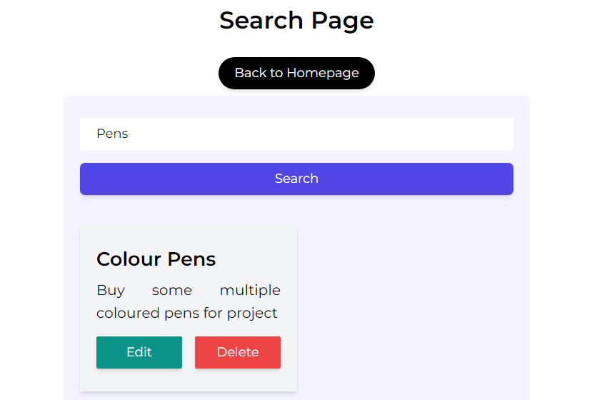
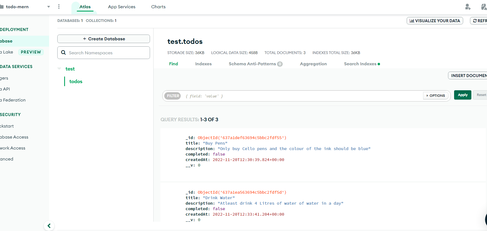

# AEONIX MERN ASSESSMENT

This is the repository for the given assignment from Aeonix Research and Innovations. The application on MERN stack.

**Task:** To create CRUD Based TODO APP

#### Tech-Stack Used
1. REACTJS (Frontend/ client Side) 
2. NODEJS (Backend/ server-side)
3. Database (MongoDB)
4. Tailwind-CSS (Styling)

#### Features
- User can create new task, it will store the task in the db.
- We can also update, read and delete a particular task
- ⭐ We can search particular tasks based on the keywords

#### **Installation Guide**

- Clone the repository using `git clone`
- Then install the depencies of the **client-side** and **server-side**
- Intallation command `npm install`
- Start the **client** and **server** side `npm start`

#### Demo Screenshots

#### Mongo Cluster Screenshot

***
**Thank you for your visit**
Do give star in this repository :star:

### Created and written by [Arkajit Roy](https://github.com/arkajitroy) :point_left: